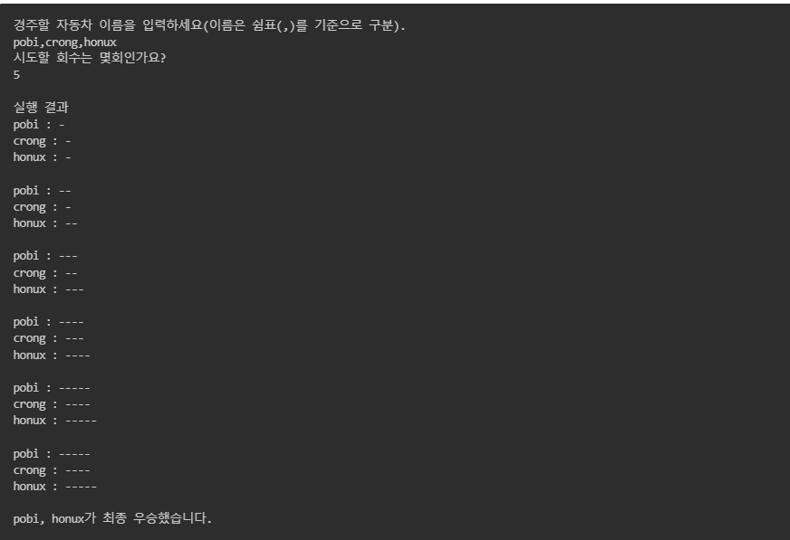

# 🚗 자동차 경주 게임

## ✔ 기능 요구사항
- [x] 각 자동차에 이름을 부여할 수 있다. 자동차 이름은 5자를 초과할 수 없다.
- [x] 전진하는 자동차를 출력할 때 자동차 이름을 같이 출력한다.
- [x] 자동차 이름은 쉼표(,)를 기준으로 구분한다.
- [x] 전진하는 조건은 0에서 9 사이에서 random 값을 구한 후 random 값이 4이상일 경우이다. 
- [x] 자동차 경주 게임을 완료한 후 누가 우승했는지를 알려준다. 우승자는 한명 이상일 수 있다.

---

## ✔ 요구사항 분석
- [x] 전진하는 조건에 맞춰 Car가 Position을 바꿔야한다.
- [x] 자동차들을 관리할 Cars Class를 구현해서 다룬다.
- [x] Cars 클래스는 게임이 끝난 후 우승자를 확인할 수 있어야한다.
- [x] 자동차 이름이 5글자가 초과되면 에러를 뱉는다.
- [x] 게임 과정이 출력되어야 한다. 

## 👀 기능 구현 화면

